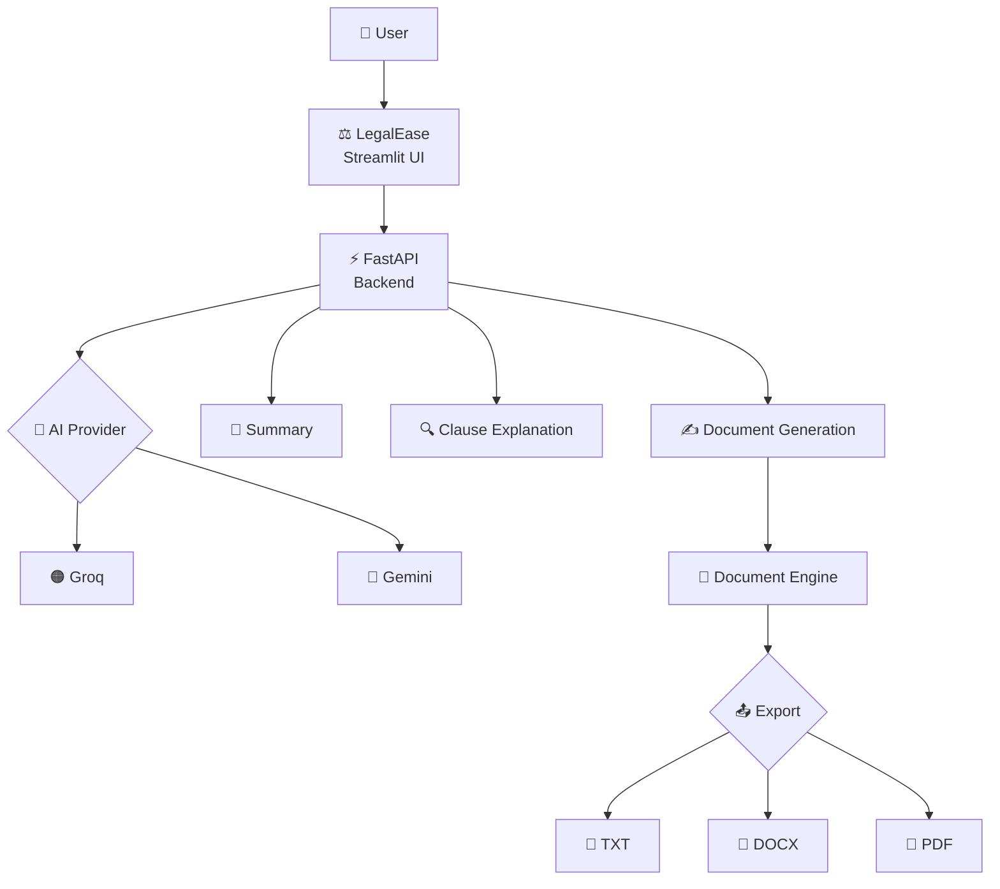
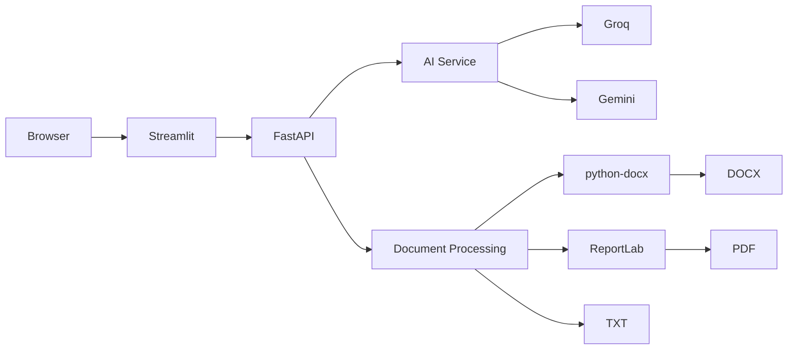

<div align="center">


<br>


<br><br>

[](https://www.python.org/)
[](https://fastapi.tiangolo.com/)
[](https://streamlit.io/)
[](https://groq.com/)
[](https://ai.google.dev/)

<br>

[](https://github.com/YOUR_USERNAME/LegalEase/stargazers)
[](https://github.com/YOUR_USERNAME/LegalEase/network/members)
[](https://github.com/YOUR_USERNAME/LegalEase/issues)
[](https://github.com/YOUR_USERNAME/LegalEase/blob/main/LICENSE)

<br><br>

**Draft smarter. Understand better. Review carefully.**

</div>

---

# ⚖️ LegalEase

### AI-Powered Legal Document Workspace

LegalEase is a modern AI-powered legal document workspace designed to make working with legal documents **simpler, faster, and more accessible**.

It brings document generation, editing, AI explanations, summarization, and exporting into one unified workspace.

```text
                 ┌───────────────────────────────┐
                 │           LegalEase            │
                 │                               │
                 │     AI Legal Document Hub     │
                 └───────────────┬───────────────┘
                                 │
              ┌──────────────────┼──────────────────┐
              │                  │                  │
              ▼                  ▼                  ▼
           ✍️ Draft           🧠 Understand       📄 Export
              │                  │                  │
              └──────────────────┼──────────────────┘
                                 ▼
                         🔍 Review & Edit
```

> **LegalEase is an AI-assisted document tool, not a substitute for qualified legal advice.**

---

# ✨ What Can LegalEase Do?

<table>
<tr>
<td width="50%">

## ✍️ AI Document Generation

Generate structured legal document drafts from natural-language requirements.

**Supported document types:**

* Employment Contract
* NDA
* Lease Agreement
* Freelance Contract
* Service Agreement
* Custom Agreement

</td>

<td width="50%">

## 🧠 AI Understanding

Turn complex legal language into easier-to-understand explanations.

**Capabilities:**

* Document summaries
* Clause explanations
* Key information
* Obligations
* Important provisions
* Simplified explanations

</td>
</tr>

<tr>
<td width="50%">

## 📝 Document Editing

Generate a document and refine it inside the workspace.

```text
Generate
   ↓
Review
   ↓
Edit
   ↓
Analyze
```

</td>

<td width="50%">

## 📄 Multi-Format Export

Export your edited document as:

```text
TXT
DOCX
PDF
```

Powered by `python-docx` and `ReportLab`.

</td>
</tr>
</table>

---

# 🎬 Product Demo

<div align="center">

### 🚀 Full LegalEase Workflow

<!-- Replace this image with your actual demo GIF -->


</div>

> 💡 **Tip:** Record a short 10–20 second GIF showing:
>
> `Create Document → AI Generation → Edit → Explain Clause → Export PDF`

---

# 🖼️ Interface Preview

<div align="center">

### 🏠 Dashboard


<br><br>

### ✍️ Document Workspace


<br><br>

### 🧠 AI Assistant


</div>

> If you don't have screenshots yet, create:
>
> ```text
> docs/
> ├── screenshots/
> │   ├── dashboard.png
> │   ├── editor.png
> │   └── assistant.png
> │
> └── demo/
>     └── legalease-demo.gif
> ```

---

# 🧠 How LegalEase Works



---

# 🏗️ System Architecture



---

# 🔄 Complete Workflow

<div align="center">

```text
┌────────────────────┐
│    👤 Describe     │
│     Your Need      │
└─────────┬──────────┘
          │
          ▼
┌────────────────────┐
│   🤖 AI Generate   │
│     Draft          │
└─────────┬──────────┘
          │
          ▼
┌────────────────────┐
│   ✏️ Edit Draft    │
│   Inside Workspace │
└─────────┬──────────┘
          │
          ▼
┌────────────────────┐
│ 🧠 Understand      │
│ Summary / Clauses  │
└─────────┬──────────┘
          │
          ▼
┌────────────────────┐
│   🔍 Review         │
│   Carefully         │
└─────────┬──────────┘
          │
          ▼
┌────────────────────┐
│   📄 Export         │
│ TXT / DOCX / PDF   │
└────────────────────┘
```

</div>

---

# 🛠️ Technology Stack

<div align="center">


</div>

<br>

| Layer          | Technology        |
| -------------- | ----------------- |
| 🎨 Frontend    | Streamlit         |
| 🎨 UI          | Custom HTML / CSS |
| ⚡ Backend      | FastAPI           |
| 🧩 Validation  | Pydantic          |
| 🤖 AI Provider | Groq / Gemini     |
| 📘 DOCX        | python-docx       |
| 📕 PDF         | ReportLab         |
| ⚛️ Original UI | React             |
| 🐍 Runtime     | Python 3.12       |

---

# 🤖 AI Provider Architecture

LegalEase uses an environment-based provider configuration.

```text
                         LegalEase
                             │
                             ▼
                    ┌─────────────────┐
                    │  AI_PROVIDER    │
                    └────────┬────────┘
                             │
                    ┌────────┴────────┐
                    │                 │
                    ▼                 ▼
                🟠 Groq           🔵 Gemini
                    │                 │
                    └────────┬────────┘
                             ▼
                       AI Response
```

Set the provider in `.env`:

```env
AI_PROVIDER=groq
```

or:

```env
AI_PROVIDER=gemini
```

---

# 🔐 Security

LegalEase keeps AI API credentials on the backend.

```text
                 ❌
        Browser → API Key

                 ✅
        Browser → FastAPI
                     │
                     ▼
                 API Key
                     │
                     ▼
                AI Provider
```

### Environment variables

```env
AI_PROVIDER=groq

GROQ_API_KEY=your_groq_api_key

GEMINI_API_KEY=your_gemini_api_key

API_BASE_URL=http://127.0.0.1:8001
```

### Never commit secrets

Your `.gitignore` should include:

```gitignore
.env
.venv/
__pycache__/
*.pyc
```

---

# 💻 Local Development

## 1. Install Python 3.12

Windows:

```powershell
winget install --id Python.Python.3.12
```

Verify:

```powershell
python --version
```

---

## 2. Clone Repository

```powershell
git clone YOUR_REPOSITORY_URL

cd LegalEase
```

---

## 3. Create Virtual Environment

```powershell
& "$env:LOCALAPPDATA\Programs\Python\Python312\python.exe" -m venv .venv
```

Activate:

```powershell
.\.venv\Scripts\Activate.ps1
```

---

# 🔑 Environment Configuration

Copy:

```text
.env.example
```

to:

```text
.env
```

Example:

```env
AI_PROVIDER=groq

GROQ_API_KEY=your_groq_api_key

GEMINI_API_KEY=your_gemini_api_key

API_BASE_URL=http://127.0.0.1:8001
```

Only the selected provider needs to be configured.

---

# ⚡ Backend

Install dependencies:

```powershell
.\.venv\Scripts\python.exe -m pip install -r backend\requirements.txt
```

Start FastAPI:

```powershell
.\.venv\Scripts\python.exe -m uvicorn app.main:app `
  --app-dir backend `
  --host 127.0.0.1 `
  --port 8001 `
  --reload
```

Backend:

```text
http://127.0.0.1:8001
```

Interactive API documentation:

```text
http://127.0.0.1:8001/docs
```

---

# 🎨 Frontend

Open another terminal.

Activate environment:

```powershell
.\.venv\Scripts\Activate.ps1
```

Install dependencies:

```powershell
.\.venv\Scripts\python.exe -m pip install -r frontend\requirements.txt
```

Start Streamlit:

```powershell
.\.venv\Scripts\python.exe -m streamlit run frontend\streamlit_app.py `
  --server.address 127.0.0.1 `
  --server.port 8501
```

Open:

```text
http://127.0.0.1:8501
```

---

# 📂 Project Structure

```text
LegalEase/
│
├── backend/
│   ├── app/
│   │   ├── main.py
│   │   ├── ...
│   │
│   └── requirements.txt
│
├── frontend/
│   ├── streamlit_app.py
│   ├── requirements.txt
│   │
│   └── src/
│       └── ...
│
├── docs/
│   ├── screenshots/
│   │   ├── dashboard.png
│   │   ├── editor.png
│   │   └── assistant.png
│   │
│   └── demo/
│       └── legalease-demo.gif
│
├── .env.example
├── .gitignore
└── README.md
```

---

# 🔌 API Reference

## `GET /`

Health check.

```http
GET /
```

---

## `POST /api/documents/generate`

Generate an AI-assisted legal document.

```http
POST /api/documents/generate
```

```text
User Requirements
       ↓
AI Provider
       ↓
Legal Document Draft
```

---

## `POST /api/ai/summary`

Summarize supplied document text.

```http
POST /api/ai/summary
```

Example:

```json
{
  "text": "Your legal document content..."
}
```

---

## `POST /api/ai/explain`

Explain a supplied legal clause.

```http
POST /api/ai/explain
```

Example:

```json
{
  "clause": "The employee shall..."
}
```

---

## `POST /api/exports/txt`

Export document text.

```http
POST /api/exports/txt
```

---

## `POST /api/exports/docx`

Generate a Word document.

```http
POST /api/exports/docx
```

Powered by:

```text
python-docx
```

---

## `POST /api/exports/pdf`

Generate a PDF document.

```http
POST /api/exports/pdf
```

Powered by:

```text
ReportLab
```

---

# 🖥️ Animated Terminal Demo

You can include a terminal GIF here:

<div align="center">


</div>

Example terminal flow:

```text
$ git clone LegalEase

$ cd LegalEase

$ python -m venv .venv

$ pip install -r backend/requirements.txt

$ uvicorn app.main:app --reload

✓ Backend started
✓ AI provider configured
✓ LegalEase ready
```

---

# 🔍 Before / After

<div align="center">

### Complex Legal Language


⬇️

### AI Explanation


</div>

---

# 📊 GitHub Stats

<div align="center">


<br><br>


</div>

---

# 🐍 Contribution Animation

<div align="center">


</div>

> If the snake animation isn't available yet, configure the GitHub Action that generates it.

---

# 📈 Project Roadmap

```text
CORE PLATFORM
━━━━━━━━━━━━━━━━━━━━━━━━━━━━━━━━━━━━━━ 100%

[x] AI Document Generation
[x] AI Summary
[x] Clause Explanation
[x] Document Editing
[x] TXT Export
[x] DOCX Export
[x] PDF Export
[x] Groq Integration
[x] Gemini Integration
[x] Streamlit Migration


NEXT GENERATION
━━━━━━━━━━━━━━━━━━━━━━━━━━━━━━━━━━━━━━

[ ] Authentication
[ ] Cloud Document Storage
[ ] Document Versioning
[ ] Document Sharing
[ ] Real-Time Collaboration
[ ] OCR
[ ] Digital Signatures
[ ] Multi-Language Support
[ ] Advanced Legal Analysis
[ ] Role-Based Access
```

---

# 🧩 Interactive Features

<details>
<summary>📄 Supported Documents</summary>

<br>

LegalEase can be used for drafting:

* Employment Contracts
* Non-Disclosure Agreements
* Lease Agreements
* Freelance Contracts
* Service Agreements
* Custom Agreements

</details>

<details>
<summary>🤖 AI Features</summary>

<br>

* AI document generation
* AI summaries
* Clause explanation
* Document understanding
* Provider switching
* Error-aware AI configuration

</details>

<details>
<summary>📤 Export Features</summary>

<br>

Supported formats:

```text
TXT
DOCX
PDF
```

</details>

<details>
<summary>🔐 Security</summary>

<br>

* API keys remain server-side
* `.env` configuration
* No fabricated AI fallback
* Browser-local document history
* Explicit provider/configuration errors

</details>

<details>
<summary>🧪 Development</summary>

<br>

Backend:

```powershell
uvicorn app.main:app --app-dir backend --reload
```

Frontend:

```powershell
streamlit run frontend/streamlit_app.py
```

</details>

---

# 🤝 Contributing

Contributions are welcome.

### 1. Fork

```bash
git fork
```

### 2. Create a branch

```bash
git checkout -b feature/your-feature
```

### 3. Make changes

```bash
git add .
```

### 4. Commit

```bash
git commit -m "feat: add your feature"
```

### 5. Push

```bash
git push origin feature/your-feature
```

Then open a Pull Request.

---

# 🐛 Issues & Feature Requests

Found a bug?

Open an issue and include:

```text
Environment
Python version
Operating system
Steps to reproduce
Expected behavior
Actual behavior
Error logs
```

For feature requests, describe:

```text
Problem
Proposed solution
Expected user experience
```

---

# ⚠️ Legal Disclaimer

LegalEase is an **AI-assisted legal document workspace**.

It does not provide legal representation and does not establish an attorney-client relationship.

AI-generated content may contain errors, omissions, or provisions that are unsuitable for a particular situation.

Documents should be reviewed by a qualified legal professional before being relied upon, signed, submitted, or used for legal purposes.

---

# 📜 License

If this project is intended to be open source, add your chosen license.

For example:

```text
MIT License
```

Then add:

```text
LICENSE
```

to the repository.

---

# 🌟 Why LegalEase?

```text
Traditional Workflow

Search
  ↓
Read
  ↓
Copy
  ↓
Edit
  ↓
Format
  ↓
Export
  ↓
Repeat


             VS


LegalEase

      Describe
          ↓
      🤖 Generate
          ↓
       ✏️ Edit
          ↓
      🧠 Understand
          ↓
       🔍 Review
          ↓
       📄 Export
```

---

<div align="center">


## ⚖️ LegalEase

### Draft smarter. Understand better. Review carefully.

<br>

**Built with Python · FastAPI · Streamlit · AI**

<br>

⭐ **Star the repository if you find LegalEase useful.**

</div>

